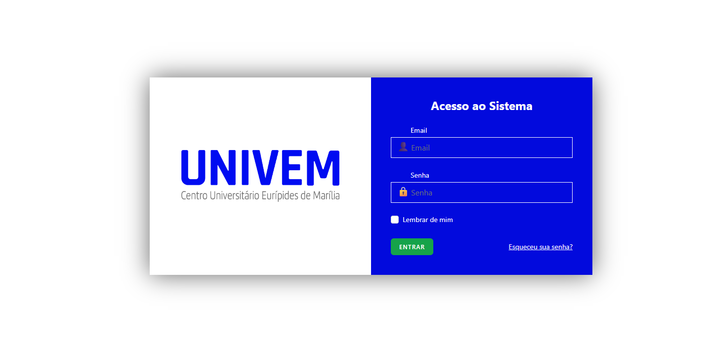
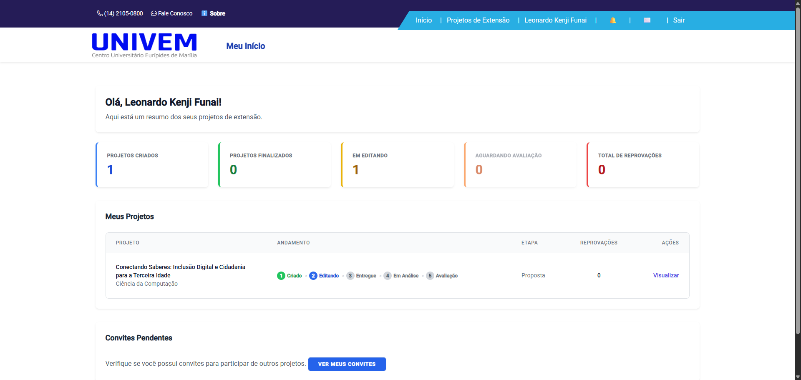
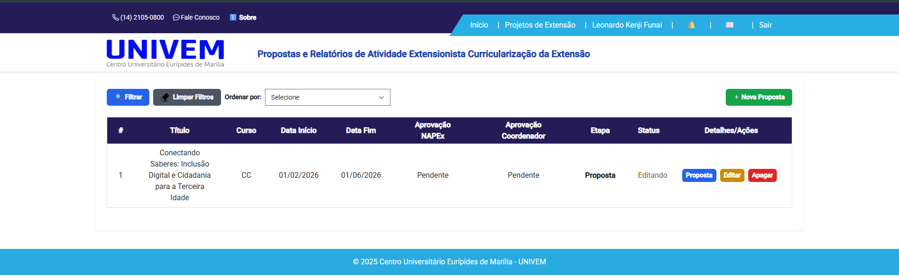
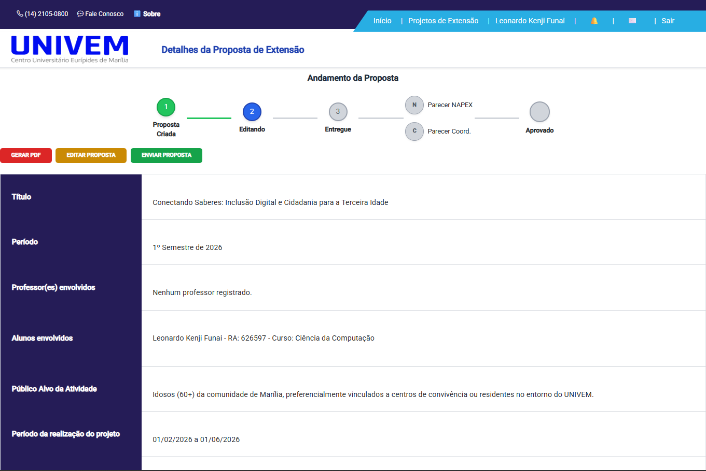

# Sistema de Curricularização da Extensão - UNIVEM


## 💻 Sobre o Projeto

Este repositório contém o código-fonte do sistema desenvolvido para o gerenciamento de **Projetos Extensionistas (Curricularização da Extensão)** do **UNIVEM (Centro Universitário Eurípides de Marília)**.

O objetivo principal deste projeto é automatizar e centralizar todo o ciclo de vida das atividades extensionistas, permitindo que alunos submetam propostas, acompanhem avaliações do NAPEx e Coordenação, e enviem os relatórios de resultados finais, eliminando o uso de processos manuais e papéis.

O sistema atende a diferentes perfis de acesso: **Alunos**, **Professores/Coordenadores**, **NAPEx** e **Administradores**.

---


## 📸 Telas do Sistema

Confira abaixo algumas telas principais do sistema em funcionamento:

| Login | Início |
|:---:|:---:|
|  |  |
| **Listagem de Projetos** | **Tela de Visualização** |
|  |  |

---

## ⚙️ Funcionalidades Principais

### 🎓 Para Alunos
- [x] **Submissão de Propostas:** Cadastro completo de projetos com título, cronograma, objetivos e anexos.
- [x] **Gestão de Equipe:** Sistema de convites para adicionar outros participantes ao projeto.
- [x] **Envio de Resultados:** Submissão do relatório final/parcial após a execução do projeto.
- [x] **Dashboard do Aluno:** Visão geral do status de todos os projetos (Em análise, Aprovado, Ajustes Necessários).
- [x] **Feedback:** Visualização detalhada dos pareceres e motivos de rejeição/ajuste.

### 🏛 Para NAPEx e Coordenadores
- [x] **Fluxo de Aprovação:** Ferramentas para avaliar propostas e relatórios (Aprovar, Reprovar ou Solicitar Correção).
- [x] **Gerenciamento de Prazos:** Controle de datas de início e fim das atividades.
- [x] **Relatórios PDF:** Geração automática de PDFs das propostas e relatórios finais.
- [x] **Exportação em Lote:** Funcionalidade para gerar ZIP com múltiplos PDFs de uma vez para arquivamento.
- [x] **Painéis Administrativos:** Dashboards com métricas e listagens filtráveis.

### 🔔 Transversais
- [x] **Notificações:** Sistema de alertas internos sobre mudanças de status e novos convites.
- [x] **Autenticação Segura:** Controle de acesso baseado em roles (funções) e permissões.

---

## 🛠 Tecnologias Utilizadas

Este projeto foi desenvolvido utilizando uma stack moderna e robusta, integrando ferramentas de alta performance para o desenvolvimento web.

### 🎨 Front-end (Interface)
* **[HTML5](https://developer.mozilla.org/pt-BR/docs/Web/HTML)** & **[CSS3](https://developer.mozilla.org/pt-BR/docs/Web/CSS)** - Estrutura e estilização base.
* **[JavaScript (ES6+)](https://developer.mozilla.org/pt-BR/docs/Web/JavaScript)** - Lógica de interatividade no cliente.
* **[Tailwind CSS](https://tailwindcss.com/)** - Framework CSS utilitário para estilização rápida e responsiva.
* **[Alpine.js](https://alpinejs.dev/)** - Framework JavaScript leve para comportamento dinâmico no front-end (modais, dropdowns).
* **[Vite](https://vitejs.dev/)** - Build tool de próxima geração para compilação rápida de assets.
* **[Axios](https://axios-http.com/)** - Cliente HTTP para requisições assíncronas e integração com o backend.
* **PostCSS & Autoprefixer** - Processamento avançado de CSS para compatibilidade entre navegadores.

### ⚙️ Back-end (Servidor)
* **[PHP 8.2+](https://www.php.net/)** - Linguagem de programação principal.
* **[Laravel Framework](https://laravel.com/)** - Framework PHP utilizado para a estrutura MVC, rotas e regras de negócio.
* **[Laravel Breeze](https://laravel.com/docs/starter-kits#laravel-breeze)** - Sistema de autenticação (Login, Registro, Recuperação de Senha).
* **MySQL** - Banco de dados relacional (gerenciado via Docker/Sail).

### 📚 Bibliotecas & Utilitários
* **[DomPDF](https://github.com/barryvdh/laravel-dompdf)** - Geração de relatórios e documentos em PDF.
* **[Laravel Excel](https://laravel-excel.com/)** - Exportação e manipulação de planilhas Excel.
* **[PHPWord](https://github.com/PHPOffice/PHPWord)** - Manipulação de arquivos Word (.docx).
* **[Pest / PHPUnit](https://pestphp.com/)** - Suíte de testes automatizados.

### 🐳 Infraestrutura & DevOps
* **[Docker](https://www.docker.com/)** - Containerização da aplicação.
* **[Laravel Sail](https://laravel.com/docs/sail)** - Interface de linha de comando para interagir com o ambiente Docker do Laravel.
* **Git & GitHub** - Controle de versão e repositório de código.
* **Mailpit** - Servidor SMTP fake para testes de envio de e-mail localmente.

---

## 🚀 Como Rodar o Projeto

### Pré-requisitos
Certifique-se de ter instalado em sua máquina:
* [Git](https://git-scm.com/)
* [Docker Desktop](https://www.docker.com/products/docker-desktop) (Recomendado)
* **OU** PHP 8.2+ e Composer (caso opte por rodar sem Docker)

### Opção 1: Rodando com Docker (Laravel Sail) - Recomendado 🐳
Este método é o mais simples, pois isola todas as dependências (PHP, MySQL, Node) em containers.

1. **Clone o repositório**
   ```bash
   git clone [https://github.com/LeonardoFunai/projeto-estagio-univem.git](https://github.com/LeonardoFunai/projeto-estagio-univem.git)
   cd projeto-estagio-univem
